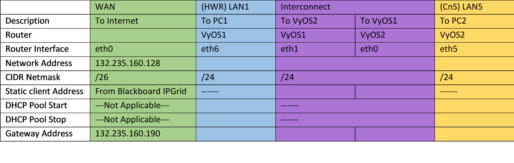

# ITS 2300 - Lab 9
## Goals 

-   Exercise existing network build skills.

-   Extend experience with IPv4 Routing

## Task 1 - Network Design
1.  CAREFULLY read the lab through before proceeding with any work (this always has been and always will be a good idea).

2.  Complete the following IP grid using the 192.168.0.0/16 network for the LAN connections.

|                           |**WAN**            |**(HWR) LAN1**     |**Interconnect**     |             |**(CnS) LAN5**
|--                         |--                 |--                 |--                   |--           |-- 
|Description                |To Internet        |To PC1             |To VyOS-2            |To VyOS-1    |To PC2
|Router                     |                   |VyOS-1             |VyOS-1               |VyOS-2       |VyOS-2
|Router Interface           |eth0               |eth6               |eth1                 |eth0         |eth5
|Network Address            |132.235.160.128    
|CIDR Netmask               |/26                |/24                |/24                  |/24          |/24
|Static client address      |From Blackboard IP Grid |--Not Applicable--|                 |             |--Not Applicable--
|DHCP Pool Start            |--Not Applicable-- |                   |--Not Applicable--
|DHCP Pool Stop             |--Not Applicable-- |                   |--Not Applicable-- 
|Gateway Address            |132.235.160.190    |                   |

Provided for reference



3.  Consult a lab notebook and previous lab(s) to draft the commands needed to deploy Interfaces, NAT, Caching DNS and DHCP for both LANs.  Do **not** plan the set protocols static yet.

4.  Create the following GNS3 project, do **not** start any objects... yet.


5.  Start the VyOS routers and apply the respective configurations.

6.  Start the VPCS and Ubuntu GUI systems and ensure that they get IP addresses from the appropriate DHCP servers.

7.  When completed, systems that share a LAN should be able to ping systems with addresses on the same LAN. 

```diff
!- Thursday objective -!
```

## Task 2 - Outbound Routing - The default route

8. Add the default route below to VyOS-1.

`set protocols static route 0.0.0.0/0 next-hop 132.235.160.190`

9.  Check connectvity by pinging a reliable IP address from VyOS-1.

10. Show the route table on VyOS-1 at a operations prompt (not config) with the command `show ip route`

11. Use the following template to develope a default route to be applied to VyOS-2, where <GATEWAY> is the IP address of the router interface on VyOS-1 in the Interconnect LAN. i.e. next-hops must be an address that is on a LAN that is directly connected to the router where the command is being applied.

````
set protocols static route 0.0.0.0/0 next-hop <GATEWAY>
````

12. VyOS-2 should be able to ping a reliable IP address.

13. Start the Ubuntu-GUI and check that is retrieves an IP address via DHCP.  This machine should be able to ping its default gateway but nothing else.
 
## Task 3 - Capturing Data

14. Ping on VyOS and Ubuntu has a series of flags that instruct the ping application to only send one ping and then quit and to wait for a shorter period of time (timeout).  This command will be helpful in this lab to limit the amount of packet capture data that needs to be processed.
 
````
ping -c 1 -W 2 8.8.8.8
````

15. Capturing data on VyOS-1's connection to the WAN is difficult because that interface sees all of the broadcast traffic on that network which includes other students.  Wireshark has the ability to filter on packets based on the Ethernet header's source MAC address.

16. Retreive the VyOS-1's MAC address on the Ethernet eth0 with the following command.
 
 ````
 run show interfaces ethernet eth0
 ````

17. Start a packet capture on the link between VyOS-1 and the Internet. 

18. The following filter shows only packets that have 8.8.8.8 as either the source or destination address and VyOS-1's eth0 MAC address as either the source or destination address.

````
ip.addr == 8.8.8.8 && eth.addr == <VYOS-1 eth0 MAC>
````

19. Start a second packet capture on the link between VyOS-1 and VyOS-2, and apply the following filter to show only traffic to 8.8.8.8
 
 ````
 ip.addr == 8.8.8.8
 ````
 
20. On the VyOS-2 router ping 8.8.8.8, and observe the ping request and ping responce packets passing by both packet caputres
 
21. On the Ubuntu GUI system ping 8.8.8.8 and observe how the flow of traffic is different.
 
## Task 4 - Return route

23. The 0.0.0.0/0 in the set protocols command at the beginning of Task 3 represents a destination of all IPv4 addresses. This can be replaced with any network address and subnet mask. The next-hop is the instruction for what next router the packet being processed should be forwarded to moving ot closer to the end of its journey. Replace these two elements to create a new command that will instruct VyOS-1 how to get to LAN5. Present this command to the class instructor or grader before proceding.

24. The Route table on each router can be viewed with the `show ip route` command.  This data might be helpful in answering questions.
 
25. Stop Wireshark and stop all the GNS3 packet capture functions.

# Questions

1.  Using data from the packet captures and show commands on the VyOS routers to compare the flow of traffic as observed in Wireshark before and after the network specific route is applied in the last task.  
 
2.  Explain why VyOS-1 didn't need the user to add a return route to get back to VyOS-2

3.  Include the VyOS1 and VyOS2 recipies.

4.  Develop a network diagram.
