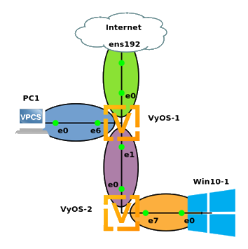

## ITS 2300 - Lab 9
### Goals 

-   Exercise existing network build skills.

-   Extend experience with IPv4 Routing

### Task 1 - Network Design
|                           |**WAN**            |**(HWR) LAN1**     |**Interconnect**                  |(CnS) LAN5
|--                         |--                 |--                 |--                   |--           |-- 
|Description                |To Internet        |To PC1&nbsp; &nbsp; &nbsp; &nbsp; &nbsp; &nbsp; &nbsp; &nbsp; &nbsp; &nbsp; &nbsp; &nbsp; &nbsp; &nbsp;         |To VyOS-2&nbsp; &nbsp; &nbsp; &nbsp; &nbsp; &nbsp; &nbsp; &nbsp; &nbsp; &nbsp; &nbsp; &nbsp; &nbsp; &nbsp; &nbsp; &nbsp; &nbsp; &nbsp;|To VyOS-1&nbsp; &nbsp; &nbsp; &nbsp; &nbsp; &nbsp; &nbsp; &nbsp;|To PC2&nbsp; &nbsp; &nbsp; &nbsp; &nbsp; &nbsp; &nbsp; &nbsp;|
|Router                     |                   |VyOS-1             |VyOS-1         |VyOS-2         |VyOS-2
|Router Interface           |eth0               |eth6               |eth1           |eth0           |eth5
|Network Address            |132.235.160.128    
|CIDR Netmask               |/26                |/24                |/24            |/24            |/24
|Static client address      |From Blackboard IP Grid   |--Not Applicable-- |||--Not Applicable--|
|DHCP Pool Start            |--Not Applicable-- |                   |--Not Applicable--
|DHCP Pool Stop             |--Not Applicable-- |                   |--Not Applicable-- 
|Gateway Address            |132.235.160.190    |                   |

### Task 3 - Boot Strap

7.  To facilitate data collection the implementation of various networks are explicitly directed by this lab write up. CAREFULLY read the lab through before proceeding with any work (this always has been and always will be a good idea).

8.  Consult a lab notebook and previous lab(s) to draft the commands needed to deploy the network below.

9.  Create the following GNS3 project, do **not** start any objects... yet.

10. Start VyOS-1 and use the following command to set a hostname that will help identify the routers command interface from VyOS-2.

`set system host-name <Name String>`

11. Repeat the previous step for VyOS-2.

12. Configure IP addresses on the used interfaces on VyOS-1 and VyOS-2.

13. Configure NAT at VyOS-1 eth0. An additional source address line will need to be added for the CnS IP network. DO NOT configure NAT on VyOS-2.

14. Configure DHCP pools for HWR LAN1 and CnS LAN5.

15. [Data] Start the VPCS and Windows 10 systems and ensure that they get IP addresses from the appropriate DHCP servers.

16. [Data] When completed, systems that share a LAN should be able to ping systems with addresses on the same LAN. Keep one set of pings that show each of the LANs is appropriately configured.

##Thursday morning objective

### Task 4 - The default route

17. Add the default route to VyOS-1.

`set protocols static route 0.0.0.0/0 next-hop 132.235.160.190`

18. Start a packet capture on the link between VyOS-1 and the Internet. Using a ether.addr filter in Wireshark and the show interfaces output from VyOS-1 to get the interfaces hardware/MAC address to filter out traffic that is only related to VyOS-1 eth0.

19. [Data] Export one ping request and one ping response showing that VyOS-1 is able to ping a reliable IP address.

20. [Data] Show the route table on VyOS-1 at a NON-config prompt with the command show `ip route`

21. Start a packet capture on the link between VyOS-1 and VyOS-2.

22. On VyOS-2 ping a reliable IP address (like 8.8.8.8).

23. [Data] Export one ping request and one ping response from each packet capture showing that VyOS-2 is able to ping a reliable IP address.

24. On the Windows Desktop system ping a reliable IP address. (This should fail)

25. [Data] Use the packet captures and route tables to identify where the packet is being lost.

### Task 5 - Return routes

26. The 0.0.0.0/0 in the set protcols command at the beginning of Task 3 represents a destination of all IPv4 addresses. This can be replaced with any network address and subnet mask. The next-hop is the instruction for what next router the packet being processed should be forwarded to moving ot closer to the end of its journey. Replace these two elements to create a new command that will instruct VyOS-1 how to get to CnS LAN5. Present this command to the class instructor or grader before proceding.

27. On the Windows Desktop system ping a reliable IP address (this should succeed).

28. [Data] Export one ping request and one ping response from each packet capture showing that Windows 10 is able to ping a reliable IP address.

29. Stop Wireshark and stop the GNS3 packet capture function on both links.

30. [Data] Collect show ip route output from both VyOS-1 and VyOS-2

### Questions

1.  Explain why VyOS-1 didn't need the user to add a return route to get back to VyOS-2.

2.  Explain why VyOS-2 does not need a route to get to HWR LAN5

3.  Show configurations from VyOS1 and VyOS2 and data collected during the lab.
