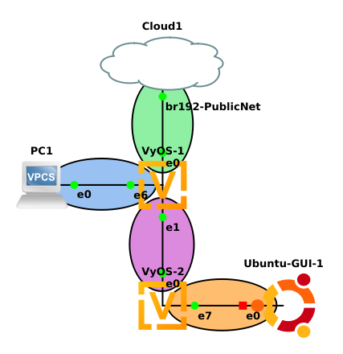

# ITS 2300 - Lab 9
## Goals 

-   Exercise existing network build skills.

-   Extend experience with IPv4 Routing

## Task 1 - Network Design
1.  To facilitate data collection the implementation of various networks are explicitly directed by this lab write up. CAREFULLY read the lab through before proceeding with any work (this always has been and always will be a good idea).

2. Complete the following IP grid using the 192.168.0.0/16 network for the LAN connections.

|                           |**WAN**            |**(HWR) LAN1**     |**Interconnect**     |             |**(CnS) LAN5**
|--                         |--                 |--                 |--                   |--           |-- 
|Description                |To Internet        |To PC1             |To VyOS-2            |To VyOS-1    |To PC2
|Router                     |                   |VyOS-1             |VyOS-1               |VyOS-2       |VyOS-2
|Router Interface           |eth0               |eth6               |eth1                 |eth0         |eth5
|Network Address            |132.235.160.128    
|CIDR Netmask               |/26                |/24                |/24                  |/24          |/24
|Static client address      |From Blackboard IP Grid |--Not Applicable--|                 |             |--Not Applicable--
|DHCP Pool Start            |--Not Applicable-- |                   |--Not Applicable--
|DHCP Pool Stop             |--Not Applicable-- |                   |--Not Applicable-- 
|Gateway Address            |132.235.160.190    |                   |

3.  Consult a lab notebook and previous lab(s) to draft the commands needed to deploy the four critical services for the network below.  This include DHCP for both LANs

4.  Create the following GNS3 project, do **not** start any objects... yet.



5.  Start the VyOS routers and apply the respective configurations.

6.  Start the VPCS and Ubuntu GUI systems and ensure that they get IP addresses from the appropriate DHCP servers.

7.  [Data] When completed, systems that share a LAN should be able to ping systems with addresses on the same LAN. Keep one set of pings that show each of the LANs is appropriately configured.

```diff
-! Thursday morning objective -!
```

## Task 2 - Outbound Routing - The default route

8. Add the default route to VyOS-1.

`set protocols static route 0.0.0.0/0 next-hop 132.235.160.190`

9.  Check connectvity by pinging a reliable IP address from VyOS-1.

10. Show the route table on VyOS-1 at a operations prompt (not config) with the command `show ip route`

11. Use the following template to develope a default route to be applied to VyOS-2, where <GATEWAY> is the IP address of the router interface on VyOS-1 in the Interconnect LAN.

`set protocols static route 0.0.0.0/0 next-hop <GATEWAY>`

12. VyOS-2 should be able to ping a reliable IP address.

13. Start the Ubuntu-GUI and check that is retrieves an IP address via DHCP.  This machine should be able to ping its default gateway but nothing else.
 
## Task 3 - Capturing Data

14. Capturing data on VyOS-1's connection to the WAN is difficult because that interfaces sees all of the broadcast traffic on that network.  Wireshark has the ability to filter on packets based on the Ethernet header's source MAC address.

15. Retreive the VyOS-1's MAC address on the Ethernet eth0 with the following command.
 
 ````
 run show interfaces ethernet eth0
 ````

16. Start a packet capture on the link between VyOS-1 and the Internet. 

17. Use the show interfaces output from VyOS-1 to get the interfaces hardware/MAC address to filter out traffic that is only related to VyOS-1 eth0.

````
eth.addr == <VYOS-1 eth0 MAC>
````
 
18. On the Ubuntu GUI system, ping a reliable IP address. (This should fail)


 
25. [Data] Use the packet captures and route tables to identify where the packet is being lost.

## Task 4 - Return routes

26. The 0.0.0.0/0 in the set protcols command at the beginning of Task 3 represents a destination of all IPv4 addresses. This can be replaced with any network address and subnet mask. The next-hop is the instruction for what next router the packet being processed should be forwarded to moving ot closer to the end of its journey. Replace these two elements to create a new command that will instruct VyOS-1 how to get to CnS LAN5. Present this command to the class instructor or grader before proceding.

27. On the Windows Desktop system ping a reliable IP address (this should succeed).

28. [Data] Export one ping request and one ping response from each packet capture showing that Windows 10 is able to ping a reliable IP address.

29. Stop Wireshark and stop the GNS3 packet capture function on both links.

30. [Data] Collect show ip route output from both VyOS-1 and VyOS-2

## Questions

1.  Explain why VyOS-1 didn't need the user to add a return route to get back to VyOS-2.

2.  Explain why VyOS-2 does not need a route to get to HWR LAN5

3.  Show configurations from VyOS1 and VyOS2 and data collected during the lab.

4.  Develop a network diagram.
